# **Ujian Akhir Semester : Deploy 2 System Apps Static Web dan Dynamic Web**
### 1. Membuat Insteance baru pada AWS Region ap-southeast-1 Singapore
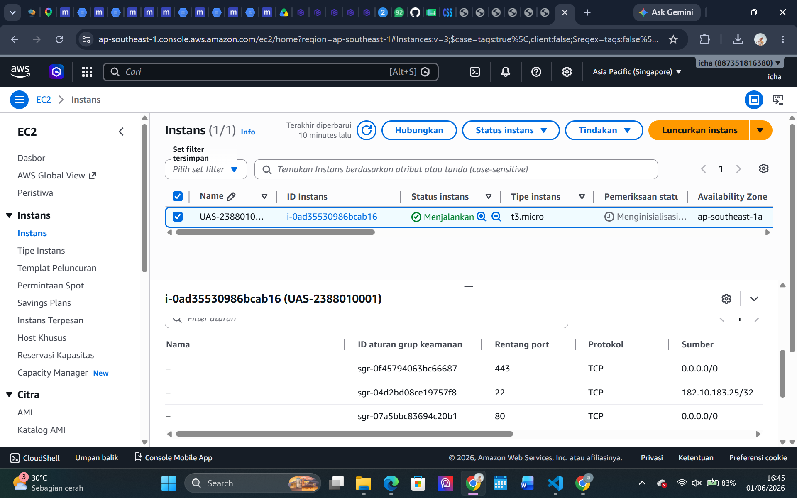
### 2. Membuat Folder Project UAS
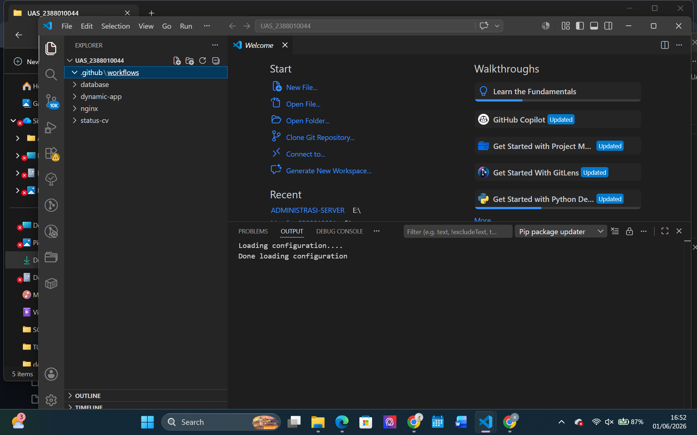
### 3. Masukkan web static UTS ke dalam folder Project UAS-CLOUD/static-cv
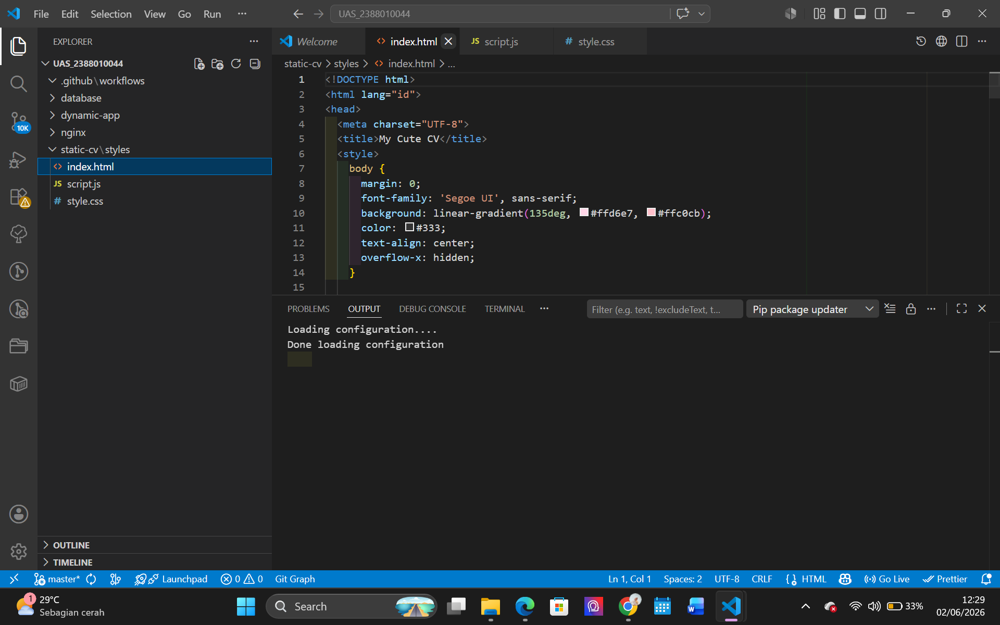
### 4. Membuat dynamic-app menggunakan PHP 
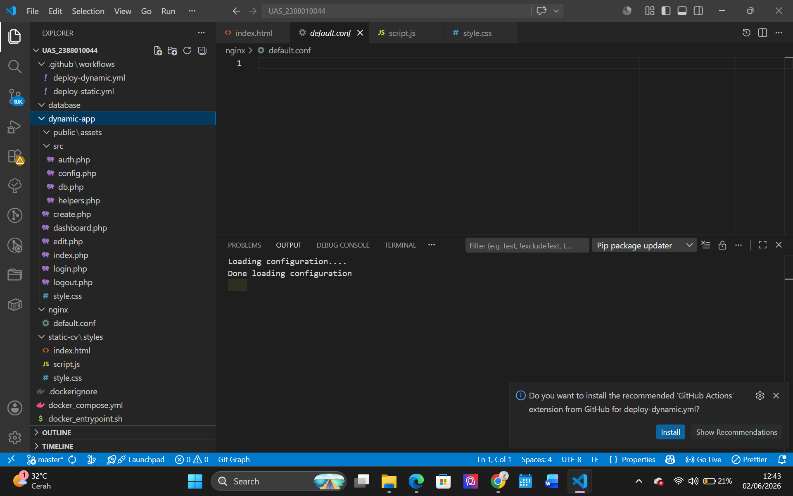
### 6. Upload Folder Project ke EC2 melalui PowerShell
    JALANKAN
    "scp -i "Masuk Ke Folder Tempan Nyimpan Key Kalian\UAS-2388010001-key.pem" -r "Masuk Ke Folder Project\UAS-2388010044" ubuntu@IP PUBLIC TERBARU:~/"

    LALU JALANKAN DOCKER COMPOSE
    "cd ~/UAS-2388010044"
    "cp .env.example .env"
    "docker compose config"
    "docker compose up -d --build"

    LALU CEK CONTAINER
    "docker compose ps"
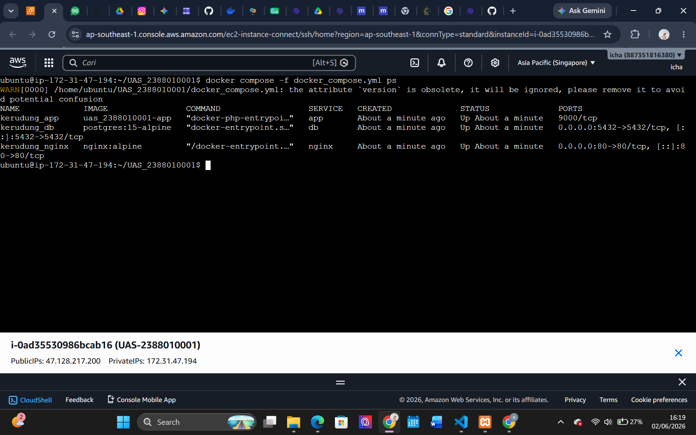
### 7. Set Up Docker Hub
    BUAT REPOSITORY BARU PADA DOCKER HUB
    "usern Docker Kamu/Nama Repo-static"
    "usern Docker Kamu/Nama Repo-dinamic"
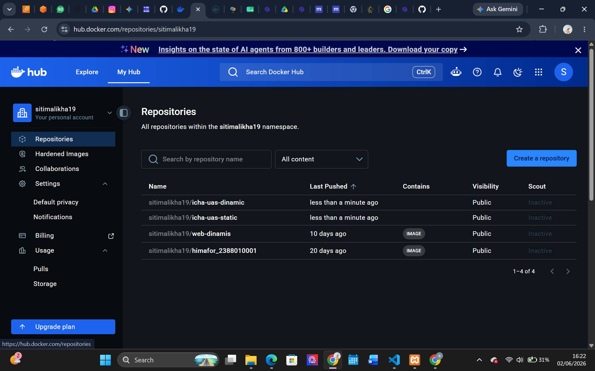

    BUAT ACCESS TOKEN DOCKER HUB
    "Account Settings -> Personal access tokens -> Generate new token"
    "Permission : Read & Write"

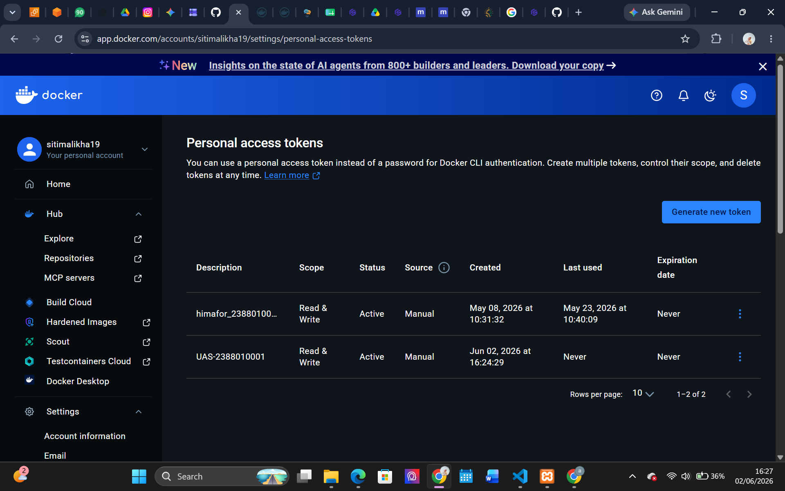
### 8. Login Docker ke EC2 Melalui PowerShell
    "docker login -u usern Kamu"
    (Saat diminta password, paste Docker Hub access token, bukan password akun biasa.)

    BUILD IMAGE DARI PROJECT
    Pastikan Posisi Folder di (cd ~/UAS-2388010001)
    lalu build "docker compose build static-cv dynamic-app"
    lalu push image ke docker hub "docker compose push static-cv dynamic-app"
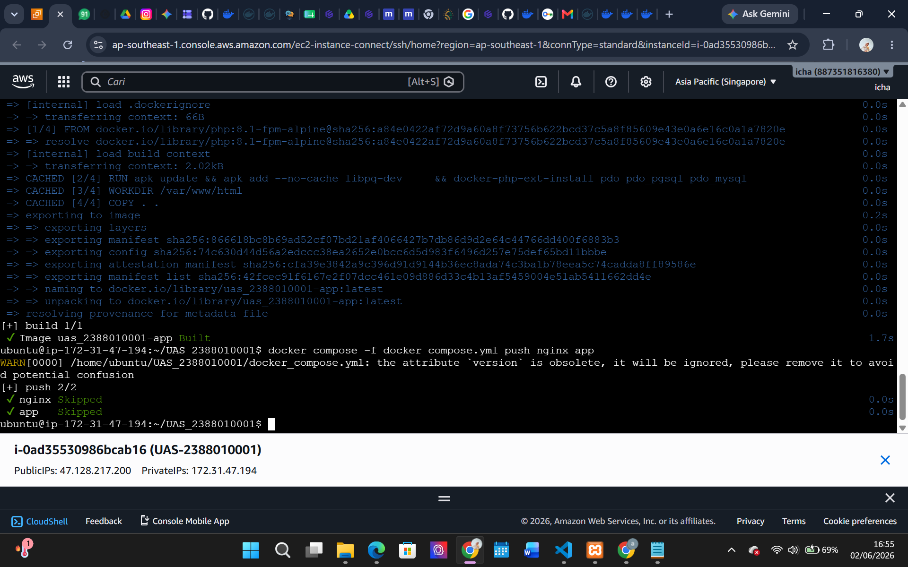
### 9. Set Up Github Repository
    BUAT REPOSITORY BARU

    LALU CONNECT FOLDER PROJECT KE REPOSITORY BARU
    "git remote add origin (Paste Link Repo Kamu)"

    LALU PUSH FOLDER PROJECT KE REPOSITORY
    "git add ."
    "git commit -m "UAS Administrasi Server""
    "git push -u origin main"
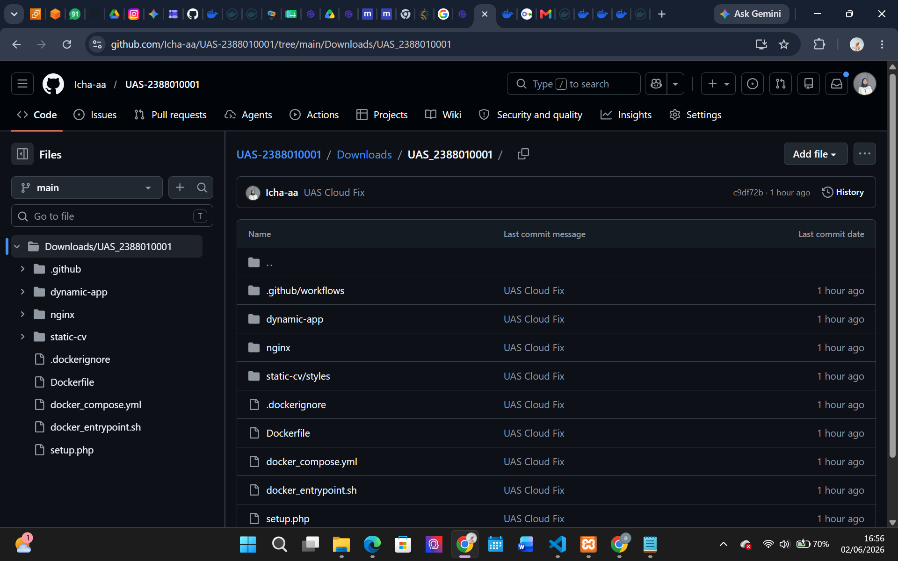
### 10. Set Up Github Secret
    DOCKERHUB_USERNAME = username Docker Kamu
    DOCKERHUB_TOKEN    = Token Docker Hub Kamu
    EC2_HOST           = IP public EC2 Terbaru
    EC2_USER           = ubuntu
    EC2_SSH_KEY        = Isi Private key .pem
    STATIC_IMAGE       = username Kamu/uas-static:latest
    DYNAMIC_IMAGE      = Username Kamu/uas-dinamic:latest
    MYSQL_DATABASE     = uas_db
    MYSQL_USER         = uas_user
    MYSQL_ROOT_PASSWORD = isi MYSQL_ROOT_PASSWORD dari .env
    MYSQL_PASSWORD      = isi MYSQL_PASSWORD dari .env
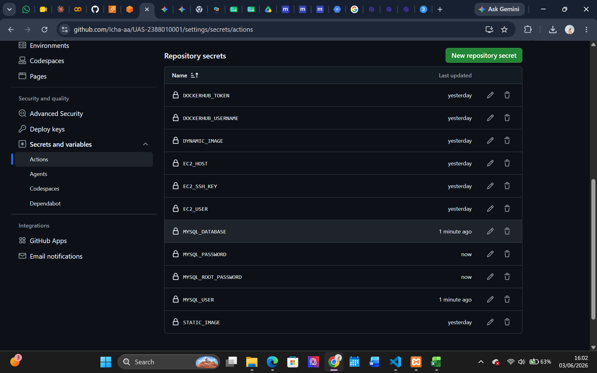
### 11. Set Up Github Action
    ".github/workflows/deploy-static.yml"
    ".github/workflows/deploy-dynamic.yml"

    CLONE REPOSITORY GITHUB KE EC2
    "rm -rf UAS-2388010001"
    "git clone (Link Repo Kamu)"
    "cd UAS-2388010001"
    "cp .env.example .env"

    COMMIT & PUSH WORKFLOW
    "git status"
    "git add .github/workflows/deploy-static.yml .github/workflows/deploy-dynamic.yml"
    "git commit -m "Add GitHub Actions deployment workflows""
    "git push origin main"
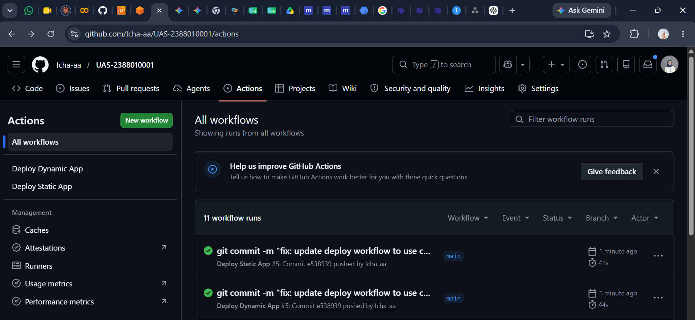
### 12. Tes Menjalankan Web Static & Dynamic
    Static

    Dynamic
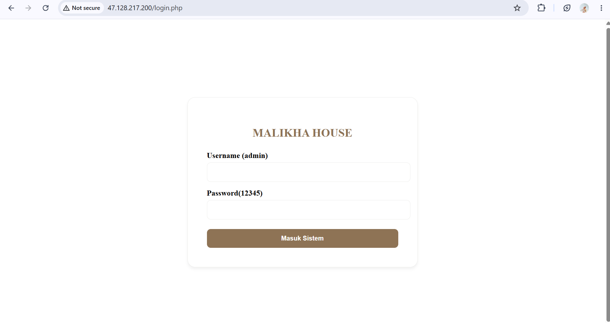